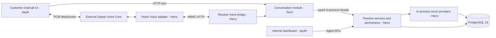

# HUTCH Resolve: team source of truth

Updated: 2026-10-02. Planning baseline: two remaining build days; Harry, Jayith and Tevin. This repository currently contains a sandbox, not a working Resolve application. Checkboxes describe implementation status, not approval of a design.

## Read first

Agents must read this file, the relevant [owner plan](docs/plans/harry.md), and the [shared contracts](docs/contracts.md) before working. After meaningful progress, update this file **and the relevant owner plan** with task IDs, changes, verification command/result, remaining work and blockers. Mark `[x]` only after implementation and verification. A proposed interface, mock test or passing unit suite is not proof of a working live integration. Label verification as static, unit, integration, browser or live. Record the implementation commit when available; never invent a hash for an uncommitted change.

Update canonical contracts before changing their implementations. Record compatibility changes here and in affected owner plans. Preserve unrelated changes. Never record credentials, transcripts from real customers, or production data. The Voice repository links here rather than maintaining another combined plan.

Authority: the reviewed master architecture (`HUTCH_Resolve_System_Architecture_Reviewed.pdf` / `.html` in the original competition workspace), final submission guidelines, and the user's updated three-person ownership/dashboard scope. The current architecture is retained. This execution plan adds a required minimal dashboard; older advice that the dashboard is optional is superseded. Master source documents are outside the Git repositories; the constraints required for implementation are restated here and in the contracts.

## Architecture and ownership

One Python/FastAPI process, PostgreSQL, one React application with customer and agent routes, and external Voice. No separate chatbot deployment, Redis, event broker or extra telecom service containers. Production identity and real operator integration remain future work.

| Owner | Responsibilities | Boundary |
| --- | --- | --- |
| [Harry](docs/plans/harry.md) | Resolve backend, APIs, permissions, schemas, providers, evidence, actions, cases, receipts, dashboard data, Voice testing/integration | Owns all business decisions and account writes |
| [Jayith](docs/plans/jayith.md) | Customer chat/call frontend and internal dashboard frontend | Renders server results; never calculates authoritative findings or permissions |
| [Tevin](docs/plans/tevin.md) | Conversation backend, extraction, clarification, knowledge routing, templates and model telemetry | Calls Resolve services; no duplicate investigation, policy or execution logic |

Stack remains Python 3.12, FastAPI, Pydantic 2, SQLAlchemy 2, Alembic, psycopg 3, PostgreSQL 18; React 19, TypeScript and Vite. Pin tested dependency versions during implementation. Existing model identifiers are configuration candidates until access is verified; do not treat historical prices/model availability in the master as current measurements.

## Verified baseline

Inspection and checks on 2026-10-02, before documentation changes:

| Area | Evidence | Status |
| --- | --- | --- |
| Resolve Git | Clean `main`; local and remote `8df74d78ff7d47f152fb6835eec463b88ae1b749` | Verified |
| Voice Git | Clean `main`; local and remote `a7f723c663fe05090851eaaa8e97ff80c770d52e` | Verified |
| PostgreSQL | `docker compose ps`: healthy; read-only SQL: 7 runs, 42 customers, 12 knowledge cards, 13 Resolve tables | Existing running environment verified; fresh initialization/reset not rerun in this documentation task |
| Resolve runtime | `backend/resolve/.gitkeep`; no application handlers or frontend | Missing |
| Existing Voice tests | `python -m pytest -q`: 15 passed in 3.53 seconds | Unit/API helper coverage verified |
| Voice streaming | Ephemeral fake WebSocket/SDK sequence: transcript fragment, tool call, separate `turn_complete`; 0 Resolve turns, `no_finalized_caller_turn`, then disconnect | Reproduced defect; Voice is partial |
| Voice SDK behavior | Installed `AsyncSession.receive()` breaks at a model `turn_complete` | Current runtime needs repeated receive cycles |
| Fixture B | Read-only SQL returned `+8000` for `OUT_OF_BUNDLE_USAGE` | Must be debit `-8000`; closing must be 2000 |
| Fixture E | Read-only SQL found two opening snapshots at the same account/time/sequence | Duplicate must be corrected in new fixture version |

The ephemeral Voice reproduction patched external clients in memory and changed no source files. It is not a committed regression test; H-08 must add one. No live microphone/provider test was performed. Existing `.env` secrets were not read or copied. Tests passing do not establish complete Voice readiness.

Other static findings to address: C's offer advertises 20 GB but its grant is 10 GB; B's `video` categories contradict documented unknown categories; fault-profile rows are configuration, not executable failure behavior; reset retains runs but does not revoke sessions/bindings; readiness marker precedes entrypoint fixture completion; SQL bootstrap has no application migration lifecycle.

## Shared contracts and connections

- [Canonical contract and authorization rules](docs/contracts.md).
- [OpenAPI 3.1 document](docs/contracts/openapi.json): proposed Resolve HTTP API; current Voice-facing models are preserved.
- [Concrete examples](docs/contracts/examples.json): synthetic contract fixtures, not actual API results.
- [Voice wire contract](https://github.com/Zeptaz/hutch_zeptazvoice/blob/main/docs/hutch-resolve-contract.md): existing external interface and known runtime limitations.

Freeze contract version `1.0.0` before parallel feature work. Harry owns shared DTOs, migrations and facade; Tevin owns the conversation module; Jayith can build against examples immediately. `openapi.json` is design documentation until runtime parity is tested. Generate frontend types from it during implementation. Runtime OpenAPI must match the frozen contract or include an explicit reviewed revision.

Development: frontend `http://localhost:5173` proxies `/api` to Resolve `http://localhost:8080`; PostgreSQL uses existing `localhost:55432`; Voice is separately configured, default `http://localhost:8088`. Browser audio connects directly to the returned Voice URL. Tevin's module needs no network service credentials. See contracts for secrets, cookies, CSRF, IDs and errors.

## Tasks and dependencies

### Existing foundation

- [x] DOC-01 Publishable combined/owner plans, agent instructions and versioned API/event specifications prepared.
- [x] DOC-02 Documentation validated: 96 schemas, 340 references, 43 examples, 5 invalid-input rejections, 26 HTTP operations, receipt digest, 4 exact existing Voice schemas plus nested proposal, 3 actual Voice model parses and 34 local links.
- [x] BASE-01 Existing repositories and correct remote `main` histories inspected.
- [x] BASE-02 Existing PostgreSQL running state and seed counts checked read-only.
- [x] BASE-03 Existing 15-test Voice suite run; runtime defects investigated separately.
- [ ] H-01 Correct/version fixtures, add migration lifecycle and safe readiness/reset. Owner Harry.
- [x] H-01a Fixture version 2 corrects B/C/E inputs and has SQL drift assertions. Owner Harry; verified on an isolated fresh PostgreSQL volume.
- [x] H-01b Alembic non-destructively adopts the legacy SQL schemas 001-003 as revision 0001. Verified current-head lookup and readiness with the app role against the isolated volume. Future schema revisions and reset/run revocation remain open.
- [x] H-01c Alembic revision `0002_domain_lifecycle` adds scoped turn claims, confirmation and idempotency records, review history, escalation delivery, case review state and explicit run retirement. Isolated PostgreSQL 18 fresh upgrade/repeat/readiness and append-only grant check passed.
- [x] H-01d Alembic revision `0003_case_investigations` adds reported case facts and originating-turn dedupe plus immutable windowed investigation evidence/calculations/source metadata and stable-command replay. Fresh upgrade and persisted A/D integration verified with the runtime role.
- [ ] H-02 Compose application, authentication, scoped repositories and shared facade. Owner Harry; depends H-01.
- [x] H-02a FastAPI liveness/readiness starter uses synchronous SQLAlchemy/Psycopg and checks the Alembic revision. Verified fake-probe tests and actual PostgreSQL integration. Auth, APIs and business services remain open.
- [x] H-02b Guest/demo customer/agent session endpoints use opaque hashed cookie credentials, fixed server-configured identity scopes, exact Origin, CSRF, atomic guest credential rotation, expiry, and logout revocation including Voice bindings. Five auth tests plus real PostgreSQL end-to-end session flow passed.
- [x] H-02c Shared `AuthContext` and `ResolveFacade` are available in-process; Tevin can create scoped conversations/cases, replay originating case turns, get scoped cases, and run idempotent investigations without loopback HTTP. Isolated PostgreSQL integration verified persisted results and cross-account 404.
- [ ] H-03 Implement provider reads/faults, cases and A/D deterministic investigation. Owner Harry; depends H-02.
- [x] H-03a Customer-only account endpoint and synthetic account/balance/subscription read; bounded charging statement reader and deterministic A/D reconciliation core. Verified on isolated seeded PostgreSQL: A exactly reconciles, D reports -7,000 conflict, incomplete evidence stays PARTIAL.
- [x] H-03b Case-origin-turn deduplication and immutable persisted investigation revisions, including saved calculations/evidence/source status, command-key replay, audit events and review-required conflict state. Verified A/D results, replay, stale-version rejection and cross-account denial against isolated PostgreSQL.
- [x] H-03c Public case detail and investigation endpoints match shared request/response DTOs, use customer/agent session scope and require stable `Idempotency-Key`; customer reports remain separate from evidence. Verified response models, replay/conflict and account/run access on isolated PostgreSQL.
- [ ] H-04 Implement all permitted proposals, confirmations, durable operations/recovery and receipts. Owner Harry; depends H-03. Remaining: broader failure cases and restart/concurrency qualification.
- [x] H-04a Customer proposal and explicit confirmation boundary. Five-minute session/case/evidence/target-version-bound proposals, stable proposal replay, CSRF/origin-protected action routes, append-only confirmation and atomic accepted PENDING operation. Fresh isolated PostgreSQL integration plus 17-test suite verified.
- [x] H-04b Single-process leased mock operation runner, sandbox-role provider writes, UNKNOWN recovery, operation polling and append-only Trust Receipts. Fresh PostgreSQL verified CRM outage recovery and one-ticket idempotency; VAS evidence, committed-response-loss recovery, one subscription mutation/event and receipt digest. `SANDBOX_DATABASE_URL` is required to execute writes; absent configuration leaves operations PENDING.
- [ ] H-05 Implement review queue/detail/update APIs and audited permissions. Owner Harry; depends H-02/H-03.
- [x] H-05a Agent queue, scoped detail and versioned review APIs; append-only notes/audit and idempotent updates. 18 tests, compileall, diff check, runtime OpenAPI and prior isolated PostgreSQL service verification pass. H-05b provider-ticket review synchronization remains.
- [ ] H-06 Implement B/C/E/F investigations and remaining failure profiles. Owner Harry; depends H-03.
- [ ] H-07 Implement Resolve Voice bridge using the conversation service. Owner Harry; depends H-02/T-02.
- [ ] H-08 Fix and qualify Voice streaming, then run a live integrated call. Owner Harry; unit fixes can begin immediately; live gate depends H-04/H-07/J-03.
- [ ] H-09 Verify access, concurrency, restart, setup and observability. Owner Harry; depends H-01 through H-08.
- [ ] T-01 Implement conversation module against shared facade fakes. Owner Tevin.
- [ ] T-02 Integrate scoped persistence, routing, clarifications and primary text journey. Owner Tevin; depends H-02/H-03.
- [ ] T-03 Integrate confirmations, handoff, FAQ and structured/model fallback. Owner Tevin; depends H-04.
- [ ] T-04 Complete secondary paths, language checks, telemetry and dialogue regressions. Owner Tevin; depends H-06/T-03.
- [ ] J-01 Build customer/agent shells and contract-backed UI mocks. Owner Jayith.
- [ ] J-02 Integrate chat, evidence, action state, receipts and review workflow. Owner Jayith; depends H-04/H-05/T-02.
- [ ] J-03 Integrate browser audio, playback acknowledgement and text continuation. Owner Jayith; depends H-07/H-08.
- [ ] J-04 Verify browser journeys, accessibility and failures. Owner Jayith; depends J-02/J-03.
- [ ] INT-01 Pass complete A text/Voice journey and D-to-dashboard review. All; Harry coordinates.
- [ ] INT-02 Pass B/C/E/F and safety/recovery/authorization acceptance matrix. All.
- [ ] REL-01 Verify fresh setup, demo access and release source; record actual model/profile and usage. Harry, supported by Tevin.
- [ ] REL-02 Final technical PDF, architecture/Gantt, AI declaration, README and known limits. Tevin; Harry reviews technical claims.
- [ ] REL-03 Presentation and actual demo recording, accessible links. Jayith; all review.
- [ ] REL-04 Record final submission commits and complete team release review. All.

Task details and acceptance live in owner plans. Do not mark INT/REL tasks complete because planning files were published.

## Two-day sequence

Elapsed windows are coordination targets, not 48 hours of continuous work per person. Protect rest and the final integration/submission window.

| Hours | Harry | Tevin | Jayith | Gate |
| --- | --- | --- | --- | --- |
| 0-4 | Contracts, fixture/schema fixes, auth skeleton, Voice failing tests | Facade fakes and dialogue schemas | Shells and examples | Stable shared contract |
| 4-14 | Providers and A/D evidence/case APIs | Primary text routing and persistence | Chat/evidence and dashboard detail | A computes 42000; D exposes -7000 mismatch |
| 14-24 | Confirmations, operations, receipts, review APIs | Actions, handoff, FAQ/fallback | Confirmation, polling, receipts, review | One complete text action and human review |
| 24-32 | B/C/E/F and Voice integration | Secondary dialogue and language checks | Call UI and text continuation | Full primary Voice path |
| 32-40 | Recovery, access, concurrency, setup | Regressions and actual usage | Browser/failure/accessibility checks | Integration acceptance |
| 40-48 | Release fixes and access/setup | Technical documents and AI disclosure | Video and presentation | Verified source matches demo |

Harry is the critical path. Tevin and Jayith work against frozen contracts immediately and own their contract tests. Cut cosmetic polish, analytics and unverified language claims before cutting evidence, authorization or confirmation safeguards. If a release gate is missed, record the exact unsupported capability; do not silently redefine completion.

## Acceptance and blockers

Release acceptance: A exact money reconciliation and one confirmed VAS deactivation; D conflict blocks account mutation; B exact quota and negative out-of-bundle charge; C supplied incident without invented ETA; E captured payment is not credited; F missing activation evidence is not consent. Include reversals, late posting, partial pages, stale evidence, lost write response, duplicate confirmation, restart and CRM delivery outage.

Cross-account/run access must fail for cases, evidence, operations, receipts and Voice bindings. Review updates must be scoped, versioned and audited. Text remains usable without Voice/model access. Voice must pass multi-turn automated tests and a real microphone journey, including interruption and continuation by text. Display simulated integration everywhere relevant.

Current blockers/risks: Resolve conversation controller and dashboard APIs, remaining complaint/provider-fault paths, restart/concurrency qualification and both frontends; reproduced Voice defects; remaining fixture/provider-fault gaps; actual model/Voice credentials, quota and live availability not verified. No HUTCH integration access will be supplied; this is expected and not a blocker for the mock demo. Final submission guidelines require prototype/source/README, technical PDF, deck, demo, architecture, limitations, AI declaration/token assumptions, implementation lifecycle/Gantt and safe evaluator access.

## Progress log

| Date | Work | Verification | Remaining |
| --- | --- | --- | --- |
| 2026-10-02 | Audited both repositories, master architecture and submission materials; confirmed two-day/one-process choices | Clean Git/remote checks, existing Voice suite, ephemeral streaming reproduction, read-only database queries | All unchecked implementation tasks above |
| 2026-10-02 | Prepared owner plans, AGENTS instructions, API specification and proposed browser interruption event | Python/jsonschema checks: 96 schemas, 340 refs, 43 examples, 5 rejection cases, 26 operations; receipt digest; Voice schema/model parity; 34 local links all pass | Application tasks remain unchecked; publication commits are discoverable in each repository's Git history |
| 2026-10-02 | Harry started on local `ResolveDev` from `cba91f0`: fixture v2 corrections/checks, Alembic adoption plus domain lifecycle revision, FastAPI health/readiness | Fresh isolated PostgreSQL 18 bootstrap; fixture invariant SQL passes; Alembic fresh/repeated upgrade reaches `0002_domain_lifecycle`; five new tables exist; runtime role can append but not rewrite review history; app-role `/api/v1/readyz` returns 200; Resolve suite 5 passed; compileall passed | Reset/session and Voice-binding revocation; reversal/fault fixtures; readiness-after-seed marker; authentication, scoped APIs/business providers/actions/receipts/dashboard; Voice defects; UI and conversation modules |
| 2026-10-02 | H-02 session security endpoints implemented on `ResolveDev` | 10 tests passed; fresh isolated PostgreSQL verified real guest creation, hash-only token storage, customer login with fixed account scope, guest CSRF upgrade/rotation, agent scope, CSRF logout/revocation and post-logout denial | AuthContext for business APIs, guest conversation transfer, throttling and complete role/nested-object authorization |
| 2026-10-02 | H-03a account and ledger provider slice | 15 tests passed; isolated seeded PostgreSQL customer endpoint returned scoped account; provider calculation reports A `SUFFICIENT` at 42,000 minor LKR and D `CONFLICTING` with -7,000 delta; partial source stays `PARTIAL`; unsafe JSON money integer is rejected; compileall/diff checks pass | Provider fault controls, recharge/VAS/usage/service providers and remaining business APIs |
| 2026-10-02 | H-03b persisted case and investigation facade | Fresh isolated DB upgraded to `0003_case_investigations`; runtime role created a scoped conversation/case, persisted A evidence/calculations/audit, replayed a stable command key without a duplicate, rejected a stale version, returned D as `REVIEW_REQUIRED` at -7,000, and hid A from account D with 404 | Public Tevin conversation routes, source-fault execution, proposal/confirmation/receipt APIs and full provider set |
| 2026-10-02 | H-03c case API surface | 16 tests pass; isolated fresh DB tested `GET /cases/{id}` and `POST /cases/{id}/investigations` response validation, customer reports, stable request replay, changed-body conflict, and customer cross-account 404/agent same-run access | Conversation routes, broader provider faults/paths, proposals/confirmed operations/receipts and review APIs |
| 2026-10-02 | H-05a agent dashboard queue/detail/review APIs on `ResolveDev` | 18 tests passed; compileall and diff checks passed; runtime OpenAPI exposes all three dashboard routes. Prior isolated PostgreSQL service checks verified cursor integrity/pagination, review replay/conflict, transitions and audit persistence. Current Docker engine access is denied, so live PostgreSQL detail-response revalidation was unavailable in this turn. | H-05b ticket review synchronization; broader concurrency/restart qualification; customer and agent frontend; conversation routes and remaining complaint/provider-fault paths |
