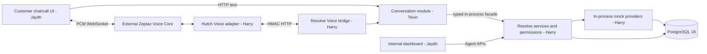

# HUTCH Resolve: team source of truth

### Voice + CRM release candidate — 2026-10-04, branch `integration/voice-crm` (both repos)

- [x] **hutch_resolve** `integration/voice-crm` = `main` `3c43f3d` (chatbot-fixes + Jayith's landing logo) + `tevin/crm-integration` `05802a8` (HubSpot CRM, CB-004/005, CE-005..012; merge `74de029`) + Harry's `voice_test` `50cb125` (merge `7419ebb`) + CB-006 `b5469aa`. Conflicts: chatbot changelog and SI/TA frontend strings (kept both sides, no duplicate keys); `conversation/service.py` x5 (kept chatbot locale/paragraph/rewrite/keep_exact handling and threaded Harry's Voice channel prompts through `_follow_up`, `_offer_draft`, `_offer_with_alternatives`, `_investigation_draft`); `docs/plans/harry.md` (kept both sections). **hutch_zeptazvoice** `integration/voice-crm` = Harry's `voice_test2` `5bbaae5` (fast-forward of `main`). `main` unchanged in both repos.
- [x] CB-006: `confirm_prompt_voice` pinned to English like the other button-only Voice prompts; the SI/TA/Singlish drafts still said "say yes or no".
- [x] CB-007 (`extract-v7`): Sinhala "remove my VAS charges" was routed to packages and "what are VAS charges" to an unrelated FAQ. Live eval on `gemini-3.5-flash-lite`, 71 cases: v6 67/71 → v7 **71/71**; live Tamil Voice probe routes both VAS questions correctly. Local note: the team key was on the Gemini free tier (500 requests/day for flash-lite, 20 for flash) and ran out during testing on 2026-10-04; billing is now enabled.
- [x] CE-014 (Voice repo `cf2c87b`, Harry to review): speech recognition hints Sinhala/English/Tamil; a late Gemini tool call no longer discards the grounded reply and waits 8–26 s to re-request it; timeouts no longer start a second provider read (`ConcurrencyError`). Live: 9/9 turns spoken, late-tool first audio 0.58–0.67 s after the Resolve result.
- Verification (unit/mock/PostgreSQL/live on this exact tree): Resolve default suite **523 passed, 49 PostgreSQL-gated skipped**; all **14 opt-in PostgreSQL files passed** via `sh scripts/run_db_tests.sh` (disposable container on 55435); Voice **71 passed**; frontend typecheck and production build pass, lint warnings only; mock Playwright **32/32 passed** after CE-013 (Harry's new Voice chat test opened `/`, which is now Jayith's landing page). **Live local stack** (Resolve 8080 on the app DB at `0011`, Voice 8088, Vite 5173, real Gemini, mock CRM): demo customer chat A complaint → reconciliation → review offer → accept → review ticket SUCCEEDED with receipt; agent dashboard lists it as Delivered. **Signed Voice probe** (real Resolve grant, v3 WebSocket, macOS-synthesized 16 kHz speech, real Gemini Live, no browser): two turns, both transcribed correctly, Resolve replied (balance; A investigation with offer), PCM streamed and `playback_ack` accepted; first PCM 6.6 s (turn 1, cold) and 1.1 s (turn 2) after `resolve_result`.
- Open: the browser pane blocks microphones, so a physical microphone/speaker call is not verified. **Harry's latest docs (`50cb125`, `5bbaae5`) describe a v4 protocol, the `POST /integrations/voice/decision-results` readback and call-language continuity, but no such code is pushed in either repo** (Voice accepts v3/v2 only; frontend offers v3). That code is in Harry's local working tree per his own note; until it is pushed, `docs/contracts.md` and the Voice contract overstate the implementation. Harry review of CE-005/007/011/012 and CB-004..006 still requested.

### HubSpot customer contacts (CE-012) — 2026-10-04, branch `tevin/crm-integration`

- [x] Each HubSpot review ticket is linked to a contact for the synthetic customer (name, line, region, language, `SYNTHETIC_DEMO`; never phone/e-mail), found or created by its unique line alias. Contract updated first. Contact problems never fail a ticket. Implemented and verified with a fake HubSpot (unit 33/33; full suite **514 passed, 49 skipped**) and PostgreSQL (all 14 opt-in files pass, 0 skips). Live (after contact scopes were added and `scripts/hubspot_setup.py properties` run): ticket `338633592538` is linked to synthetic contact Nimali Perera (SIM-LK-0001); before the scopes, tickets were still delivered unlinked with a startup warning. Dev note: two Resolve stacks on `localhost` (5173/8080 and 5175/8081) share the same cookie names, so using both in one browser logs each other out; the branch test stack is served on `127.0.0.1:5175`. Needs Harry's approval of the contract change (MEDIUM).

### HubSpot CRM integration onto main (CE-005..011, CB-004..005) — 2026-10-03, branch `tevin/crm-integration`

- Branch = `origin/tevin/chatbot-fixes` `4b305ff` + merge of `origin/main` `d7dc9da` (`3281d02`, Jayith's dashboard fixes incl. the case-detail 500 on confirmed cases) + the HubSpot work from `tevin/hubspot-crm` `61d8506`, **ported change by change** rather than merged from its old fork point `46d41ed`. Commits: `54a4b58` CRM adapter/runner/config/scripts/docs, `ddf619d` chatbot fixes, `2d0c8ce` frontend fixes, `b4c0dc3` Jayith's `eff54ce` (sync RUNNING→PENDING), `2d34967` chatbot escalation fix. Not pushed. Nothing on `main` changed.
- Kept main's version where main already fixed the same defect (proposal KeyError, provisional-ledger merge, escalation filter, turn_claims, confirmation `simulation`, escalation reason). Not ported, for Harry: scenario A VAS offer/ordering, fixture opening snapshots at 1 Oct 00:00, Voice binding string compare (CE-011). `CRM_PROVIDER=mock` remains the default.
- Found on main and fixed in the chatbot (CB-005): "I want a real person" after a case returned **500** because `facade.propose_escalation` parses the chat's non-UUID command key as a UUID and writes dialogue state mid-turn (CE-007, engine unchanged).
- Verification: unit **505 passed, 48 PostgreSQL-gated skipped** (`.venv/bin/python -m pytest -q`; baseline 473/40); CRM unit `tests/test_hubspot_crm.py` 24 + adapter 4 passed. PostgreSQL on disposable per-file databases (`sh scripts/run_db_tests.sh`, own container on 55435; never 55432): **all 14 opt-in files pass with 0 skips** on the final code (all 48 gated tests ran: conversation runtime 6, real-facade conversation 22, HubSpot writer 6, action faults 3, audit repairs 22 incl. unit, audit worker 2, operation restart 2, package 1, quota 6, review sync 1 + recovery 2, seed 3, turn reconciliation 2, Voice bridge 1). Frontend typecheck pass, lint exit 0 (4 existing warnings); mock Playwright not rerun. **Browser, mock CRM** (branch on 8081/5175, disposable DB on 55436): D complaint → review → accept → seeded CRM outage UNKNOWN → SUCCEEDED → dashboard Delivered → start review "Synced to ticket". **Live HubSpot** (team account, synthetic data, real Gemini): A complaint → decline → "I want a real person" → accept → HubSpot ticket `338730627792` → dashboard "Open in HubSpot" link → start review → Synced; API read-back: stage IN_REVIEW, tagged note present.
- Open: Harry review of CE-005 (BIG), CE-007, CE-011 and CB-004/005 (HIGH); Jayith review of CE-006/008/009; first Gemini extraction call timed out at the 6 s budget once (fallback menu shown); HubSpot multi-worker lease overrun (known); closing to the HubSpot Closed stage verified live on 2026-10-04 (ticket `338552685274`: note + close synced, stage CLOSED).

### Chatbot language fix (CB-001) — 2026-10-03, branch `tevin/chatbot-fixes`

- [x] **Merged into `main` on 2026-10-04** as merge commit `0375c4b` (pushed and remote-confirmed on `origin/main`). Before merging, a trial merge with `main` `d6615fa` had no conflicts and the merged tree passed **474 passed, 40 PostgreSQL-gated skipped**; the same result was rerun on `0375c4b` before pushing. The branch changes only `backend/resolve/conversation/**`, `tests/conversation/**` and docs: no engine, migration, contract or frontend files. Merged at Tevin's decision without Harry's prior review of the CB-001 text-chat rewrite policy (partial reversal of AUD-01); that review is still requested. `si-Latn.json` remains an unreviewed draft and is not active.

- [x] Singlish/Sinhala customers got fixed English replies: Gemini detected `si`/`LATIN` correctly, but `_localize` never rewrote any case reply (0 `REPLY_REWRITE` calls ever) and the si/ta locales are unreviewed native-script drafts. Text-chat findings/offers/balance replies are now rewritten into the customer's style (opt-in `rewrite_allowed`, stricter fact check incl. verbatim target labels and kept questions, prompt `rewrite-v3`); English original persisted; cards/buttons stay English and authoritative. Operation outcomes, consent prompts, declines and all Voice replies stay deterministic. Text replies are paragraphed. Locale now follows script (`si`+Latin → `si-Latn`); new `locales/si-Latn.json` is an UNREVIEWED machine draft and is not used until fluent review.
- Verification: unit **461 passed, 40 PostgreSQL-gated skipped**; live Gemini with fake Resolve on the reported messages; browser + local live stack: both messages answered in Singlish, `rewrite-v3` `OK` rows recorded. Fluent human review of Singlish quality, Tamil live samples and Harry's AUD-01 sign-off remain open. Implementation commit `73677a4` is pushed and remote-confirmed on `origin/tevin/chatbot-fixes`.
- [x] CB-003: Sinhala/Tamil customers never got knowledge answers (search filtered `language=si` but all 12 cards are `en`); now falls back to English cards. Added `account_topic` extraction (`extract-v6`) so "what are my VAS charges / packages" lists services/packages from the account view, offers a records check, and a VAS investigation reply quotes posted `VAS_CHARGE` lines verbatim. Simple prompts are translatable after a case exists (consent prompt excluded). Unit **473 passed, 40 skipped**; browser on local live stack verified the reported message end to end. CE-004 requests price per subscription in the account view.
- Change logs: [chatbot changes](docs/changelogs/chatbot-changes.md) (CB-NNN, risk LOW/MEDIUM/HIGH) and [core engine requests](docs/changelogs/core-engine-changes.md) (CE-NNN, risk SMALL/MEDIUM/BIG): CE-001 localizable engine text (MEDIUM), CE-002 internal "Reason:" note shown to customers (SMALL), CE-003 optional "show original" field (MEDIUM).

### Full-system verification and fixes — 2026-10-03

- [x] All **39 PostgreSQL-gated checks** in the Resolve suite were run against separate disposable PostgreSQL 18 Compose projects with fresh migration/fixture state; each passed. Coverage includes action faults, operation restart, package activation, quota, review sync/recovery, audit worker, signed Voice bridge, domain repairs, conversation/facade, seed/reset and turn reconciliation. Existing shared containers were left untouched.
- [x] Implemented revision 0011 and agent-only `POST /api/v1/agent/conversations/{conversation_id}/turns/{turn_id}/reconcile`. It requires an expired claim and valid AGENT run scope, refuses PENDING/RUNNING/UNKNOWN related operations, records a durable audit event, and makes the old turn terminal/non-replayable. Database integration checks exercise active lease and unresolved-operation refusal, settlement after a terminal operation result, audit persistence, same-turn replay denial and a fresh succeeding turn. API test verifies CSRF and scoped context.
- [x] Fixed recharge/ledger evidence severity merging so a complete recharge lookup cannot upgrade an incomplete ledger result to SUFFICIENT. Removed the former expected-failure marker; the PostgreSQL conversation test now passes.
- [x] Migration-upgrade path from revision 0010 to head applied successfully. PostgreSQL privilege check confirms `hutch_resolve_app` can SELECT `sandbox.offers` and cannot UPDATE it. Fresh setup/migration/seed also passed across isolated test groups.
- [x] Final non-database Resolve suite: **443 passed, 39 PostgreSQL-gated skipped** (the gated checks passed separately above). Frontend OpenAPI generation, typecheck and production build pass; mock browser suite **23/23 passed and exited 0**. Voice repository was not changed; its prior test run remains **52 passed**. No live model/microphone call was performed.
- Resolve implementation commit `a4223df` is pushed and remote-confirmed on `origin/ResolveDev`.
- [ ] Live configured model/microphone qualification and production release soak remain open. The safe mock end-to-end path is qualified; these live credentials/hardware checks are separate gates.

### Audit remediation update — 2026-10-03

- [x] Fixed turn-claim row mapping and package-only proposal evaluation; corrected strict package evidence, proposal, dashboard and operation projections.
- [x] Escalation now scopes investigation through the case/account, preserves the customer's reason, and persists a pending proposal reference in the conversation. The existing customer confirmation card can present it and the established turn/confirmation logic applies. PostgreSQL regression is added but not run.
- [x] Unsupported answer outcome claims are rejected. Frontend Voice retry-key and stale-start regressions pass.
- [x] Zeptaz Voice adapter gates all model-generated speech against canonical Resolve `speech_text`, falls back to that text, and emits a sanitized error on tool failure. `hutch_zeptazvoice/adapter_buildation` commit `3bc6a27` is pushed and remote-confirmed.
- [x] Security/reproducibility: enforce Secure cookies outside local HTTP, trust forwarded addresses only across configured proxy hops, bound HTTP request bodies to 1 MiB, correct readiness voice capability, serialize review ticket backfill with case review, fence sandbox writes against retired runs, make fixture reset/offer allowlist atomic, and wait for all Docker DB initialization scripts before readiness.
- [x] Least privilege: migration `0010` revokes Resolve app-role UPDATE on sandbox offers; the dedicated sandbox writer remains the mutation path.
- [x] Frontend durability: failed logout preserves recoverable session state; agent review retries persist same body/key across reload and can replay after a committed response is lost. Voice grant retry/call startup guards remain passing.
- [x] Contract/dependency cleanup: package contract generator is idempotent and root-relative; duplicate OpenAPI/type enum entries removed. Unused `shadcn` CLI removed, MIT stylesheet/license vendored. Full npm audit reports zero vulnerabilities.
- Verification on ResolveDev: backend suite **439 passed, 36 PostgreSQL-gated skipped**; seed tests **2 passed, 1 DB-gated skipped**; frontend typecheck/build pass; lint exits 0 with six existing warnings; full mock E2E after the review retry fix reports **22/22 passed**. Playwright's Windows process hung during teardown after all tests reported green and was interrupted; its command did not exit cleanly. The earlier failure exposed that a definitive `409 STALE_VERSION` retained the retry key and left Add note enabled. Definitive `409`/`422` responses now clear the key; network/unknown outcomes retain it. Focused conflict + committed-response-lost browser tests also both passed. Voice suite **52 passed**. Contract generator run twice produced identical SHA-256 `75259C6F9F9E3857ECD8C08FFACF261A3A177ECB071D428AAB5092D002363E9E`; full npm audit reports zero vulnerabilities.
- [x] PostgreSQL transaction/recovery, migration grant, package projection, escalation persistence and CRM delivery checks completed in isolated disposable databases. Abandoned-turn reconciliation now has an audited, terminal agent path. The expanded browser suite exits cleanly (23/23). See `docs/plans/harry.md` for details.

Updated: 2026-10-03. The mock sandbox, Resolve business backend, in-process conversation controller and combined frontend are implemented to the tested scope below. Browser Voice/model and final release qualification remain open. Historical baseline rows below record earlier findings; current status is in the task list and latest checkpoints. Checkboxes describe implementation and verification, not approval of a design.

## UI and conversation integration checkpoint

On 2026-10-02 `ResolveDev` fetched Jayith's `HutchChat` tip `9e7b8b1` and `VoiceFrontend` tip `4349eed`. The selected frontend was integrated into Resolve and pushed as `f2c9bab`. Source branches and the Voice runtime branch were not rewritten. Voice uses browser protocol `zeptaz-hutch-v2`. The conversation module is now mounted in Resolve using its existing scoped turn claims and consent gate. Do not mark a live Voice/browser journey complete until it has been exercised with the actual services.

Frontend integration checkpoint: the combined React app reuses one customer session and conversation across chat and call, adds explicit demo customer sign-in, v2 response-scoped playback and agent review controls. `VITE_API_MODE=live` is the default; scripted mock mode is visibly synthetic. A clean `npm ci`, pinned OpenAPI generation, TypeScript check and production build passed; lint exits 0 with warnings. No browser or live Voice call has been verified. Disposable PostgreSQL verifies text turn replay, guest upgrade, scoped reads and signed Voice proposal/confirmation through the mounted conversation service.

Dashboard branch intake on 2026-10-03: `origin/ResolveDashboard` tip `6fe6acb` was fetched and its agent dashboard selectively integrated into the same React app. A full branch merge would regress the newer Voice frontend and conversation backend, so those files were preserved. The imported dashboard uses the existing agent queue/detail/review APIs and adds responsive evidence/actions/conversation/receipt/history tabs, a versioned internal review panel and browser tests. The combined app typechecks and builds. The mock browser suite passes 15/15; five live browser checks pass against a disposable Resolve database. The integration commit is recorded in Git after push.

## Read first

Agents must read this file, the relevant [owner plan](docs/plans/harry.md), and the [shared contracts](docs/contracts.md) before working. After meaningful progress, update this file **and the relevant owner plan** with task IDs, changes, verification command/result, remaining work and blockers. Mark `[x]` only after implementation and verification. A proposed interface, mock test or passing unit suite is not proof of a working live integration. Label verification as static, unit, integration, browser or live. Record the implementation commit when available; never invent a hash for an uncommitted change.

Update canonical contracts before changing their implementations. Record compatibility changes here and in affected owner plans. Preserve unrelated changes. Never record credentials, transcripts from real customers, or production data. The Voice repository links here rather than maintaining another combined plan.

Authority: the reviewed master architecture (`HUTCH_Resolve_System_Architecture_Reviewed.pdf` / `.html` in the original competition workspace), final submission guidelines, and the user's updated three-person ownership/dashboard scope. The current architecture is retained. This execution plan adds a required minimal dashboard; older advice that the dashboard is optional is superseded. Master source documents are outside the Git repositories; the constraints required for implementation are restated here and in the contracts.

## Architecture and ownership

One Python/FastAPI process, PostgreSQL, one React application with customer and agent routes, and external Voice. No separate chatbot deployment, Redis, event broker or extra telecom service containers. Production identity and real operator integration remain future work.

| Owner | Responsibilities | Boundary |
| --- | --- | --- |
| [Harry](docs/plans/harry.md) | Resolve backend, APIs, permissions, schemas, providers, evidence, actions, cases, receipts, dashboard data, Voice testing/integration | Owns all business decisions and account writes |
| [Jayith](docs/plans/jayith.md) | Customer chat/call frontend and internal dashboard frontend | Renders server results; never calculates authoritative findings or permissions |
| [Tevin](docs/plans/tevin.md) | Conversation backend, extraction, clarification, knowledge routing, templates and model telemetry | Calls Resolve services; no duplicate investigation, policy or execution logic |

Stack remains Python 3.12, FastAPI, Pydantic 2, SQLAlchemy 2, Alembic, psycopg 3, PostgreSQL 18; React 19, TypeScript and Vite. Pin tested dependency versions during implementation. Existing model identifiers are configuration candidates until access is verified; do not treat historical prices/model availability in the master as current measurements.

## Verified baseline

Inspection and checks on 2026-10-02, before documentation changes:

| Area | Evidence | Status |
| --- | --- | --- |
| Resolve Git | Clean `main`; local and remote `8df74d78ff7d47f152fb6835eec463b88ae1b749` | Verified |
| Voice Git | Clean `main`; local and remote `a7f723c663fe05090851eaaa8e97ff80c770d52e` | Verified |
| PostgreSQL | `docker compose ps`: healthy; read-only SQL: 7 runs, 42 customers, 12 knowledge cards, 13 Resolve tables | Existing running environment verified; fresh initialization/reset not rerun in this documentation task |
| Resolve runtime | `backend/resolve/.gitkeep`; no application handlers or frontend | Missing |
| Existing Voice tests | `python -m pytest -q`: 15 passed in 3.53 seconds | Unit/API helper coverage verified |
| Voice streaming | Ephemeral fake WebSocket/SDK sequence: transcript fragment, tool call, separate `turn_complete`; 0 Resolve turns, `no_finalized_caller_turn`, then disconnect | Reproduced defect; Voice is partial |
| Voice SDK behavior | Installed `AsyncSession.receive()` breaks at a model `turn_complete` | Current runtime needs repeated receive cycles |
| Fixture B | Read-only SQL returned `+8000` for `OUT_OF_BUNDLE_USAGE` | Must be debit `-8000`; closing must be 2000 |
| Fixture E | Read-only SQL found two opening snapshots at the same account/time/sequence | Duplicate must be corrected in new fixture version |

The ephemeral Voice reproduction patched external clients in memory and changed no source files. It is not a committed regression test; H-08 must add one. No live microphone/provider test was performed. Existing `.env` secrets were not read or copied. Tests passing do not establish complete Voice readiness.

Other static findings to address: C's offer advertises 20 GB but its grant is 10 GB; B's `video` categories contradict documented unknown categories; fault-profile rows are configuration, not executable failure behavior; reset retains runs but does not revoke sessions/bindings; readiness marker precedes entrypoint fixture completion; SQL bootstrap has no application migration lifecycle.

## Shared contracts and connections

- [Canonical contract and authorization rules](docs/contracts.md).
- [OpenAPI 3.1 document](docs/contracts/openapi.json): proposed Resolve HTTP API; current Voice-facing models are preserved.
- [Concrete examples](docs/contracts/examples.json): synthetic contract fixtures, not actual API results.
- [Voice wire contract](https://github.com/Zeptaz/hutch_zeptazvoice/blob/main/docs/hutch-resolve-contract.md): existing external interface and known runtime limitations.

Shared contract version is `1.2.0`, including agent-authorized terminal reconciliation for stalled turns. Harry owns shared DTOs, migrations and facade; Tevin owns the conversation module; Jayith builds against examples. `openapi.json` is design documentation until runtime parity is tested. Generate frontend types from it after changes. Runtime OpenAPI must match the reviewed contract.

Development: frontend `http://localhost:5173` proxies `/api` to Resolve `http://localhost:8080`; PostgreSQL uses existing `localhost:55432`; Voice is separately configured, default `http://localhost:8088`. Browser audio connects directly to the returned Voice URL. Tevin's module needs no network service credentials. See contracts for secrets, cookies, CSRF, IDs and errors.

## Tasks and dependencies

### Existing foundation

- [x] DOC-01 Publishable combined/owner plans, agent instructions and versioned API/event specifications prepared.
- [x] DOC-02 Documentation validated: 96 schemas, 340 references, 43 examples, 5 invalid-input rejections, 26 HTTP operations, receipt digest, 4 exact existing Voice schemas plus nested proposal, 3 actual Voice model parses and 34 local links.
- [x] BASE-01 Existing repositories and correct remote `main` histories inspected.
- [x] BASE-02 Existing PostgreSQL running state and seed counts checked read-only.
- [x] BASE-03 Existing 15-test Voice suite run; runtime defects investigated separately.
- [ ] H-01 Correct/version fixtures, add migration lifecycle and safe readiness/reset. Owner Harry.
- [x] H-01a Fixture version 2 corrects B/C/E inputs and has SQL drift assertions. Owner Harry; verified on an isolated fresh PostgreSQL volume.
- [x] H-01b Alembic non-destructively adopts the legacy SQL schemas 001-003 as revision 0001. Verified current-head lookup and readiness with the app role against the isolated volume. Later schema revisions are tracked separately.
- [x] H-01c Alembic revision `0002_domain_lifecycle` adds scoped turn claims, confirmation and idempotency records, review history, escalation delivery, case review state and explicit run retirement. Isolated PostgreSQL 18 fresh upgrade/repeat/readiness and append-only grant check passed.
- [x] H-01d Alembic revision `0003_case_investigations` adds reported case facts and originating-turn dedupe plus immutable windowed investigation evidence/calculations/source metadata and stable-command replay. Fresh upgrade and persisted A/D integration verified with the runtime role.
- [x] H-01e Operator reset creates a new active run while atomically retiring earlier runs and revoking sessions/Voice bindings. A lifecycle-column preflight blocks unsafe reset before migration; disposable PostgreSQL verifies success and duplicate-run rollback.
- [ ] H-02 Compose application, authentication, scoped repositories and shared facade. Owner Harry; depends H-01.
- [x] H-02a FastAPI liveness/readiness starter uses synchronous SQLAlchemy/Psycopg and checks the Alembic revision. Verified fake-probe tests and actual PostgreSQL integration. Auth, APIs and business services remain open.
- [x] H-02b Guest/demo customer/agent session endpoints use opaque hashed cookie credentials, fixed server-configured identity scopes, exact Origin, CSRF, atomic guest credential rotation, expiry, and logout revocation including Voice bindings. Five auth tests plus real PostgreSQL end-to-end session flow passed.
- [x] H-02c Shared `AuthContext` and `ResolveFacade` are available in-process; Tevin can create scoped conversations/cases, replay originating case turns, get scoped cases, and run idempotent investigations without loopback HTTP. Isolated PostgreSQL integration verified persisted results and cross-account 404.
- [ ] H-03 Implement provider reads/faults, cases and A/D deterministic investigation. Owner Harry; depends H-02.
- [x] H-03a Customer-only account endpoint and synthetic account/balance/subscription read; bounded charging statement reader and deterministic A/D reconciliation core. Verified on isolated seeded PostgreSQL: A exactly reconciles, D reports -7,000 conflict, incomplete evidence stays PARTIAL.
- [x] H-03b Case-origin-turn deduplication and immutable persisted investigation revisions, including saved calculations/evidence/source status, command-key replay, audit events and review-required conflict state. Verified A/D results, replay, stale-version rejection and cross-account denial against isolated PostgreSQL.
- [x] H-03c Public case detail and investigation endpoints match shared request/response DTOs, use customer/agent session scope and require stable `Idempotency-Key`; customer reports remain separate from evidence. Verified response models, replay/conflict and account/run access on isolated PostgreSQL.
- [ ] H-04 Implement all permitted proposals, confirmations, durable operations/recovery and receipts. Owner Harry; depends H-03. Remaining: Voice confirmation/presentation gate and broader soak qualification.
- [x] H-04c Worker restart/concurrent-claim integration. Disposable PostgreSQL verifies committed-response-loss recovery after an expired RUNNING lease with one VAS mutation/event/receipt, and two concurrent runners claiming one pending CRM action once.
- [x] H-04d Action fault qualification. Disposable PostgreSQL verifies CRM unavailability/recovery, terminal VAS write rejection without mutation, and committed-write/response-loss followed by failed operation lookup and same-key recovery. Exactly one subscription mutation/event/receipt; the lookup fault is consumed only when a prior provider operation exists.
- [x] H-04a Customer proposal and explicit confirmation boundary. Five-minute session/case/evidence/target-version-bound proposals, stable proposal replay, CSRF/origin-protected action routes, append-only confirmation and atomic accepted PENDING operation. Fresh isolated PostgreSQL integration plus 17-test suite verified.
- [x] H-04b Single-process leased mock operation runner, sandbox-role provider writes, UNKNOWN recovery, operation polling and append-only Trust Receipts. Fresh PostgreSQL verified CRM outage recovery and one-ticket idempotency; VAS evidence, committed-response-loss recovery, one subscription mutation/event and receipt digest. `SANDBOX_DATABASE_URL` is required to execute writes; absent configuration leaves operations PENDING.
- [x] H-05 Implement review queue/detail/update APIs, audited permissions and mock-ticket sync. Owner Harry; depends H-02/H-03.
- [x] H-05a Agent queue, scoped detail and versioned review APIs; append-only notes/audit and idempotent updates. 19 tests, compileall, diff check, runtime OpenAPI and prior isolated PostgreSQL service verification pass.
- [x] H-05b Durable review-ticket outbox and leased mock CRM writer. Isolated PostgreSQL test injects committed-response-loss, retries with the event-derived provider key, verifies one ticket version/note update, and checks idempotent replay returns SYNCED. Fault selection now maps generated fixture line aliases rather than UUID suffixes.
- [x] H-05c Review sync restart and claim qualification. Disposable PostgreSQL verifies a fresh runner settles committed-response-loss with one ticket version/note update and matching replay; a concurrent worker cannot claim a live lease and causes no duplicate update.
- [ ] H-06 Implement B/C/E/F investigations and remaining failure profiles. Owner Harry; depends H-03.
- [x] H-06a Pure deterministic quota reconciliation core and tests. Unit coverage verifies expected and conflicting arithmetic, consume-to-usage links, reversal integrity and incomplete sources.
- [x] H-06b Seeded DATA_DEPLETION provider and persisted investigation. Opt-in isolated PostgreSQL end-to-end test verifies quota bucket reaches zero, usage-to-consume links, separate -8,000 minor-unit balance posting and public investigation response validation.
- [x] H-06c Seeded CONNECTIVITY provider and persisted investigation. Matching fresh account check and regional incident give C a grounded finding; absent ETA stays absent. Empty/stale incident feeds do not infer healthy service. Opt-in isolated PostgreSQL test passes.
- [x] H-06d Seeded E payment/fulfilment evidence and BALANCE_RECHARGE investigation. Captured-but-pending fulfilment is not credited or treated as complete; response explicitly says not to submit a duplicate payment. Same-sequence snapshots with the same amount are valid repeat observations; changed amount/currency stays conflicting.
- [x] H-06e Seeded F VAS_DISPUTE activation evidence handling. Missing activation record is explicit and not consent; future VAS renewal stop is separately eligible and remains unaccepted until customer confirmation. PostgreSQL integration verifies the proposal consequence leaves historic charges under investigation.
- [x] H-06f Money ledger checks linked reversals and duplicate external posting references without double-counting related original rows. Unit checks and fresh B/C/E/F PostgreSQL matrix pass.
- [x] H-06g Charging/usage read fault profiles are consumed once through the optional sandbox writer: late, missing opening, incomplete page and stale source become PARTIAL; duplicate reference, bad reversal and wrong unit become CONFLICTING with unit evidence. Disposable PostgreSQL tests verify outcomes and one-shot consumption; readiness requires migration `0006_audit_hardening`.
- [ ] H-07 Implement Resolve Voice bridge using the conversation service. Owner Harry; depends H-02/T-02.
- [x] H-07a Resolve-owned Voice session provisioning, callback authentication, active binding checks, durable event/turn deduplication, retry with stable downstream key, and the injected conversation-service boundary. No schema migration was needed. Ten focused tests and a disposable PostgreSQL test verified grants, replay, revocation and runtime-role writes.
- [x] H-07a audit hardening: revision `0006_audit_hardening` fences event/turn claims, stores Voice consent provenance, serializes conversation turns, bounds signed callback bodies at 16 KiB, and moves bridge database calls off the async route. Disposable PostgreSQL 18 migrated through 0006; 22 focused domain/worker/Voice integration checks passed. These checks use a stub conversation service, so H-07b remains open. Resolve repair commit `a92bea5` is remotely confirmed on `ResolveDev`.
- [x] H-07b Mount Tevin's real `ConversationService` on text and Voice routes, sharing persisted turn claims and Resolve's consent gate. Disposable PostgreSQL verifies text replay and a signed Voice proposal/presentation/accept/replay path; HTTP voice projection uses the persisted result. Browser microphone and actual model qualification remain H-08/J-03 work.
- [ ] H-08 Fix and qualify Voice streaming, then run a live integrated call. Owner Harry; fake-runtime fixes are verified and pushed; live gate depends H-04/H-07/J-03 and real provider credentials.
- [x] H-08a Voice fake-runtime hardening on `hutch_zeptazvoice/adapter_buildation`: transcript finalizes on SDK `input_transcription.finished` independently of model completion; repeated turns, proposal acknowledgement/interruption invalidation, bounded `end_session`, and task/provider cleanup are covered. 26 Voice tests pass; commit `a6c3ea3` is remotely confirmed.
- [x] H-08b Fake-runtime safety and retry hardening: protocol `zeptaz-hutch-v2` correlates audio/playback/proposal acknowledgements by `response_id`, buffers and checks sensitive speech, rejects malformed/early acknowledgements, retains stable turn IDs for retryable pending results, and bounds Resolve retries. Full Voice suite: 34 passed. Voice repair commit `3f33b03` is remotely confirmed on `adapter_buildation`. Jayith must implement the v2 browser controls; a live Gemini/browser call is still open.
- [ ] H-09 Verify access, concurrency, restart, setup and observability. Owner Harry; depends H-01 through H-08.
- [x] H-09a JSON HTTP request observability logs request ID, method, route template, status, elapsed time and stable error code. No bodies, query values, credentials, transcripts, raw payloads or exception text; focused app/middleware tests pass.
- [x] H-09b Action and review-sync worker logs correlate case/operation or review-event IDs, action type, attempt, status, elapsed time and bounded error code. Tests confirm safe fields only; provider/customer payloads are excluded.
- [ ] H-09c Isolate opt-in PostgreSQL tests by fixture run/database. A shared-container broad run first failed because older modules defaulted to a different run ID; after setting it, earlier tests left pending operations and removed accounts consumed by later modules. A fresh database passed the previously failing CRM action fault test. Do not count the shared-container broad run as a product regression or as a passing suite.
- [x] T-01 Conversation DTOs, ports, fakes and contract parity tests are imported and pass; revision 0007 persists dialogue state and model-call metadata.
- [x] T-02 Scoped text routes, persistent turn replay, guest FAQ and customer case journey run against Resolve's facade. Disposable PostgreSQL checks the route, replay and guest upgrade.
- [ ] T-03 Confirmations, handoff, FAQ and structured/model fallback are implemented in the imported controller and unit tested. Full six-scenario browser and actual-model qualification remains open.
- [ ] T-04 Complete secondary paths, language checks, telemetry and dialogue regressions. Owner Tevin; depends H-06/T-03.
- [x] J-01 Customer/agent shells, separate session handling, typed API client and contract-backed mocks are implemented; 15 mock browser checks pass across desktop/phone. Live backend journeys remain J-02/J-04.
- [ ] J-02 Integrate chat, evidence, action state, receipts and review workflow. Owner Jayith; depends H-04/H-05/T-02.
- [ ] J-03 Integrate browser audio, playback acknowledgement and text continuation. Owner Jayith; depends H-07/H-08.
- [ ] J-04 Verify browser journeys, accessibility and failures. Owner Jayith; depends J-02/J-03.
- [ ] INT-01 Pass complete A text/Voice journey and D-to-dashboard review. All; Harry coordinates.
- [ ] INT-02 Pass B/C/E/F and safety/recovery/authorization acceptance matrix. All.
- [ ] REL-01 Verify fresh setup, demo access and release source; record actual model/profile and usage. Harry, supported by Tevin.
- [ ] REL-02 Final technical PDF, architecture/Gantt, AI declaration, README and known limits. Tevin; Harry reviews technical claims.
- [ ] REL-03 Presentation and actual demo recording, accessible links. Jayith; all review.
- [ ] REL-04 Record final submission commits and complete team release review. All.

Task details and acceptance live in owner plans. Do not mark INT/REL tasks complete because planning files were published.

## Two-day sequence

Elapsed windows are coordination targets, not 48 hours of continuous work per person. Protect rest and the final integration/submission window.

| Hours | Harry | Tevin | Jayith | Gate |
| --- | --- | --- | --- | --- |
| 0-4 | Contracts, fixture/schema fixes, auth skeleton, Voice failing tests | Facade fakes and dialogue schemas | Shells and examples | Stable shared contract |
| 4-14 | Providers and A/D evidence/case APIs | Primary text routing and persistence | Chat/evidence and dashboard detail | A computes 42000; D exposes -7000 mismatch |
| 14-24 | Confirmations, operations, receipts, review APIs | Actions, handoff, FAQ/fallback | Confirmation, polling, receipts, review | One complete text action and human review |
| 24-32 | B/C/E/F and Voice integration | Secondary dialogue and language checks | Call UI and text continuation | Full primary Voice path |
| 32-40 | Recovery, access, concurrency, setup | Regressions and actual usage | Browser/failure/accessibility checks | Integration acceptance |
| 40-48 | Release fixes and access/setup | Technical documents and AI disclosure | Video and presentation | Verified source matches demo |

Harry is the critical path. Tevin and Jayith work against frozen contracts immediately and own their contract tests. Cut cosmetic polish, analytics and unverified language claims before cutting evidence, authorization or confirmation safeguards. If a release gate is missed, record the exact unsupported capability; do not silently redefine completion.

## Acceptance and blockers

Release acceptance: A exact money reconciliation and one confirmed VAS deactivation; D conflict blocks account mutation; B exact quota and negative out-of-bundle charge; C supplied incident without invented ETA; E captured payment is not credited; F missing activation evidence is not consent. Include reversals, late posting, partial pages, stale evidence, lost write response, duplicate confirmation, restart and CRM delivery outage.

Cross-account/run access must fail for cases, evidence, operations, receipts and Voice bindings. Review updates must be scoped, versioned and audited. Text remains usable without Voice/model access. Voice must pass multi-turn automated tests and a real microphone journey, including interruption and continuation by text. Display simulated integration everywhere relevant.

Current blockers/risks: The conversation controller, Resolve Voice bridge and combined customer/dashboard frontend are now integrated; earlier progress-log blockers describe their historical state. Actual model credentials/quota, physical microphone/Voice runtime qualification, six-scenario customer browser checks, native-language review and broader worker concurrency/upgrade qualification remain open. The 2026-10-03 audit found 12 unresolved defects; see [the detailed report](docs/audits/2026-10-03-resolve.md). No external Voice repository changes or verification were performed in this audit. No HUTCH integration access will be supplied; this is expected for the simulated environment. Final submission still requires the verified prototype/source/README, technical PDF, deck/demo, architecture, limitations, AI disclosure/token assumptions, lifecycle/Gantt and safe evaluator access.

## Progress log

| Date | Work | Verification | Remaining |
| --- | --- | --- | --- |
| 2026-10-03 | Merged ResolveDev to `main` while retaining the seven remote frontend commits; integrated frontend conflicts were resolved from the later ResolveDev tree | `python -m pytest -q` in `.venv`: 443 passed, 39 PostgreSQL-gated skips; frontend typecheck/build pass; mock browser E2E 23/23 pass; staged `git diff --check` clean. The Voice repo fast-forwarded `adapter_buildation` to `main`; Voice suite 52 passed. | Default pytest skips the opt-in database tests; their isolated disposable-PostgreSQL qualification is recorded in the prior Resolve checkpoints. Live Gemini/model/microphone/browser release qualification remains open. |
| 2026-10-03 | Package activation integration phase | Resolve package query/selection routes through the in-process facade and produce a scoped PACKAGE_ACTIVATION case, evidence snapshot and hash-bound typed proposal; worker writes one MAIN debit, one-shot subscription/quota and Trust Receipt. Disposable PostgreSQL 18 verified fresh bootstrap, migration `0009`, generated-run reset/allowlist, concurrent same-offer confirmations (one accepted), one debit/subscription/provider operation, and receipt. Conversation suite: 347 passed/16 DB-gated; package DB integration: 1 passed; reset unit tests: 2 passed/1 DB-gated. Frontend API generation/build and mock E2E 19/19 pass; Voice suite: 49 passed. Resolve commit `d5c881a` and Voice commit `93a0a1b` are pushed to their designated branches. | Package-specific crash/lost-response and injected provider failure recovery still need a PostgreSQL test. Broader 34 PostgreSQL-gated tests were not rerun on the temporary DB. Full-suite collection uses split interpreters because global Python lacks `psycopg` and project venv lacks `cryptography`. Feature remains off by default. |
| 2026-10-02 | Audited both repositories, master architecture and submission materials; confirmed two-day/one-process choices | Clean Git/remote checks, existing Voice suite, ephemeral streaming reproduction, read-only database queries | All unchecked implementation tasks above |
| 2026-10-02 | Prepared owner plans, AGENTS instructions, API specification and proposed browser interruption event | Python/jsonschema checks: 96 schemas, 340 refs, 43 examples, 5 rejection cases, 26 operations; receipt digest; Voice schema/model parity; 34 local links all pass | Application tasks remain unchecked; publication commits are discoverable in each repository's Git history |
| 2026-10-02 | Harry started on local `ResolveDev` from `cba91f0`: fixture v2 corrections/checks, Alembic adoption plus domain lifecycle revision, FastAPI health/readiness | Fresh isolated PostgreSQL 18 bootstrap; fixture invariant SQL passes; Alembic fresh/repeated upgrade reaches `0002_domain_lifecycle`; five new tables exist; runtime role can append but not rewrite review history; app-role `/api/v1/readyz` returns 200; Resolve suite 5 passed; compileall passed | Reset/session and Voice-binding revocation; reversal/fault fixtures; readiness-after-seed marker; authentication, scoped APIs/business providers/actions/receipts/dashboard; Voice defects; UI and conversation modules |
| 2026-10-02 | H-02 session security endpoints implemented on `ResolveDev` | 10 tests passed; fresh isolated PostgreSQL verified real guest creation, hash-only token storage, customer login with fixed account scope, guest CSRF upgrade/rotation, agent scope, CSRF logout/revocation and post-logout denial | AuthContext for business APIs, guest conversation transfer, throttling and complete role/nested-object authorization |
| 2026-10-02 | H-03a account and ledger provider slice | 15 tests passed; isolated seeded PostgreSQL customer endpoint returned scoped account; provider calculation reports A `SUFFICIENT` at 42,000 minor LKR and D `CONFLICTING` with -7,000 delta; partial source stays `PARTIAL`; unsafe JSON money integer is rejected; compileall/diff checks pass | Provider fault controls, recharge/VAS/usage/service providers and remaining business APIs |
| 2026-10-02 | H-03b persisted case and investigation facade | Fresh isolated DB upgraded to `0003_case_investigations`; runtime role created a scoped conversation/case, persisted A evidence/calculations/audit, replayed a stable command key without a duplicate, rejected a stale version, returned D as `REVIEW_REQUIRED` at -7,000, and hid A from account D with 404 | Public Tevin conversation routes, source-fault execution, proposal/confirmation/receipt APIs and full provider set |
| 2026-10-02 | H-03c case API surface | 16 tests pass; isolated fresh DB tested `GET /cases/{id}` and `POST /cases/{id}/investigations` response validation, customer reports, stable request replay, changed-body conflict, and customer cross-account 404/agent same-run access | Conversation routes, broader provider faults/paths, proposals/confirmed operations/receipts and review APIs |
| 2026-10-02 | H-05a agent dashboard queue/detail/review APIs on `ResolveDev` | 19 tests passed; compileall and diff checks passed; runtime OpenAPI exposes all three dashboard routes. Prior isolated PostgreSQL service checks verified cursor integrity/pagination, review replay/conflict, transitions and audit persistence. | H-05b ticket review synchronization; broader concurrency/restart qualification; customer and agent frontend; conversation routes and remaining complaint/provider-fault paths |
| 2026-10-02 | H-05b review-ticket sync on `ResolveDev` | Fresh migration `0005_review_ticket_sync`; isolated app/sandbox PostgreSQL roles; committed-response-loss fault produced UNKNOWN, retry with same event key produced SYNCED, one ticket version/note update, and idempotent review replay returned SYNCED. Generated run exposed UUID-suffix fault selection; fixed to use stable SIM line alias. | Multi-worker/restart stress, explicit unavailable/rejected sync outcome browser handling; customer/agent frontend and conversation routes |
| 2026-10-02 | H-06a quota reconciliation core on `ResolveDev` | 22 tests passed; compileall and diff checks passed. Pure deterministic tests verify byte snapshots against ordered bucket postings, consume-to-usage correspondence, safe separation of out-of-bundle usage and partial/conflicting outcomes. | Provider query, persisted DATA_DEPLETION investigation/API integration, recharge fulfilment (E), connectivity (C), activation (F), ticket sync and remaining fault profiles |
| 2026-10-02 | H-06b DATA_DEPLETION provider/API path on `ResolveDev` | Fresh isolated PostgreSQL 18 migration and synthetic run; provider reads selected quota snapshots/entries/usage; complete facade investigation persisted as SUFFICIENT; API response model validated; asserted 20 GB quota reaches zero and separate -8,000 minor LKR charge reconciles to 2,000; fixture invariant SQL passes; opt-in PostgreSQL test added | H-05b ticket status synchronization; B fault profiles; E recharge fulfilment; C service/incident checks; F activation evidence; broader restart/concurrency verification |
| 2026-10-02 | H-06c CONNECTIVITY investigation on `ResolveDev` | Fresh isolated PostgreSQL seeded C integration verifies active package, fresh account provisioning check and matching regional degraded incident; persisted investigation response validates; no ETA fabricated. Unit tests verify empty/stale feeds and failing checks. | H-05b ticket status synchronization; B fault profiles; E recharge fulfilment; F activation evidence; broader restart/concurrency verification |
| 2026-10-02 | H-06d E recharge investigation on `ResolveDev` | Isolated PostgreSQL B/C/E integration tests pass; seeded E's captured payment and pending fulfilment are explicit evidence with no linked money entry; API response validates and duplicate payment advice is suppressed. Snapshot duplicate handling now flags only same-sequence value/currency conflicts. Full suite 30 passed, 3 opt-in integration tests skipped by default. | H-05b ticket status synchronization; B fault profiles; F activation evidence; broader restart/concurrency verification |
| 2026-10-02 | H-06e F VAS activation evidence on `ResolveDev` | Four seeded PostgreSQL integration tests pass; F returns PARTIAL with explicit absent activation evidence and no consent claim; current recurring VAS still permits proposal for a future stop, without confirmation/mutation, and carries the historic-dispute boundary | H-05b ticket status synchronization; B fault profiles; remaining activation/recharge provider failures; broader restart/concurrency verification |
| 2026-10-02 | H-06f Money ledger integrity on `ResolveDev` | Unit checks enforce duplicate reference and opposite amount/currency reversal links; fresh isolated PostgreSQL migration and all four B/C/E/F persisted investigation integration tests pass after provider shape update | Seeded late/duplicate/reversal fault execution and operation recovery/restart/concurrency qualification; H-05b ticket sync; broader remaining provider failures |
| 2026-10-02 | H-06g charging/usage fault execution on `ResolveDev` | Disposable PostgreSQL migrated through `0005`; one-shot late/missing-opening charging and incomplete-page/stale/wrong-unit usage profiles were consumed. Incomplete/stale evidence returned PARTIAL; duplicate reference, reversal mismatch and wrong unit returned CONFLICTING; temporary volumes removed. Provider fault tests passed. | CRM outage/rejection/lookup profiles and broader action/review-worker qualification |
| 2026-10-02 | H-04c worker recovery/concurrent claim on `ResolveDev` | Fresh disposable PostgreSQL migrated through `0005`; VAS provider commit followed by lost response was recovered after a fresh runner reclaimed an expired lease, yielding one mutation/event/receipt. Two concurrent runners claimed a CRM ticket action once; exactly one ticket, provider operation and receipt. Both integration tests passed and the temporary volume was removed. | Broader multi-process/restart stress, review-sync contention, remaining provider faults and frontend/conversation work |
| 2026-10-02 | H-09a HTTP request observability on `ResolveDev` | Four middleware tests and four app health/logging tests pass; verifies route-template logging, request ID response correlation, stable error code and omission of request data/exception text. Compileall and diff checks pass. | Provider/action operation correlation fields and protected diagnostics |
| 2026-10-02 | H-04d action fault and H-05c review-sync qualification | Disposable PostgreSQL migrated through `0005`; 3 action-fault tests pass (CRM outage recovery, VAS rejection/no mutation, lost response + unavailable lookup + same-key success with one mutation/event); 2 review-sync tests pass (fresh-runner recovery and live-lease exclusion, one ticket update); 6 quota/provider integration tests pass. Full unit suite: 37 passed, 11 opt-in skipped. | Resolve conversation controller/Tevin integration, Voice bridge/qualification, broader soak and schema-upgrade test, both frontends |
| 2026-10-02 | H-09b worker operation observability | Focused HTTP/worker observability checks 11 passed; full unit suite 40 passed, 14 opt-in PostgreSQL skipped; compileall and diff check pass. Logs include scoped worker correlation IDs, attempts, outcomes and duration without customer/provider payloads. | Broader protected diagnostics/metrics and production telemetry integration |
| 2026-10-02 | H-07a Resolve-owned Voice bridge | Ten focused bridge tests pass; disposable PostgreSQL 18 fresh volume upgraded through `0005`; runtime role provisioned a session-bound binding, processed and replayed one signed turn without a duplicate, persisted integration/turn records, and denied a new callback after logout revocation. Full suite: 51 passed, 15 opt-in PostgreSQL tests skipped; compileall and diff checks pass. | Tevin's real ConversationService and live dialog/result integration; Voice fake-runtime work is underway on the verified `adapter_buildation` branch. |
| 2026-10-02 | H-08a Voice fake-runtime hardening | On `hutch_zeptazvoice/adapter_buildation`, commit `a6c3ea3` is pushed and remote hash confirmed. Full Voice suite 26 passed; compile and diff checks pass. Synthetic runtime coverage includes finished transcription independent of model completion, deferred tool routing, repeated turns, proposal acknowledgement/interruption invalidation, bounded end-session, disconnect/provider failure, and cleanup. | Live Gemini/microphone/Resolve path, remaining voice safety matrix, browser playback queue flush, and real Tevin controller integration |
| 2026-10-03 | Combined frontend intake on ResolveDev | Selective UI integration from `HutchChat` and `VoiceFrontend` was committed and remotely confirmed as `f2c9bab`. `npm ci`, OpenAPI generation, typecheck and build pass; lint exits 0 with warnings. | Actual browser/service qualification and UI acceptance matrix |
| 2026-10-03 | Conversation and Resolve Voice integration | Revision 0007, text routes, mounted dialogue controller, session-scoped conversation creation replay, guest-to-customer public history transfer and durable signed Voice projection are implemented. Full default suite 420 passed/34 opt-in skipped; five disposable PostgreSQL tests pass, including Voice proposal/presentation/accept/replay. Contract example parity has no expected failures. | Real model and browser microphone call, six-scenario UI journey, native-language human review and release matrix. External Voice repo was not changed in this phase. |
| 2026-10-03 | ResolveDashboard frontend intake | Selective import from `origin/ResolveDashboard` `6fe6acb` preserved current chat/Voice and backend. New agent queue, case packet tabs and versioned review UI use existing agent APIs. Found and fixed stale review acknowledgement and nested-route keyboard navigation through Playwright. Typecheck/build pass; lint exits 0 with warnings; 15 mock browser checks pass. Unique disposable PostgreSQL project migrated through 0007 and seeded six cases; five live dashboard browser checks pass, including review conflict, CSRF and role isolation. Test project and volume removed. Backend suite remains 420 passed/34 opt-in skipped. | Actual microphone/model call, six-scenario customer browser release checks and accessibility review. |
| 2026-10-04 | Voice call keeps running after an offer decision | Tapping Yes/No on a call offer no longer hangs up and returns to the chat. The mic is held muted only while the decision is sent (so a spoken turn cannot race it), then restored. Each resulting operation shows in the call with its status, ticket number, and on a terminal state a review receipt (`CREATE_REVIEW_TICKET` or `REVIEW_REQUIRED`) or Trust Receipt (other actions) with a download. Frontend mock E2E 33/33 (new review-in-call test; call test now asserts the call stays connected with a Trust Receipt); `tsc -b` and build pass. | Not yet checked on a live call. Voice still cannot speak the tapped decision's reply (no browser-to-Voice message for it); the reply shows as a caption. |

## Current audit follow-up ? 2026-10-03

Source: [Resolve integration audit](docs/audits/2026-10-03-resolve.md), baseline `2b52b722e1a9bb6f0149d767a2ecaf28831b0298` on ResolveDev. The report distinguishes API/unit reproductions from static findings; current implementation and verification status is recorded below.

- [x] AUD-01 Tevin: deterministic case/action/financial replies bypass rewriting; signed decimal, outcome polarity and supported-link regressions added. Unit/conversation verification passes; real-model qualification remains open.
- [x] AUD-02 Harry: investigation writes now use customer Origin/CSRF guard; API regression tests pass.
- [ ] AUD-03 Harry/Tevin/Jayith: atomic expected-version claim and persisted text resume are implemented. Abandoned Voice and legacy text claims fail closed, but still require an authorized durable reconciliation policy; later turns can remain blocked. PostgreSQL race/restart checks are unavailable.
- [x] AUD-04 Jayith: late microphone permission and repeated cleanup are guarded; focused fake-media tests pass. Real browser microphone qualification remains open.
- [ ] AUD-05 Harry/Jayith: idempotent escalation route and reason persistence are implemented with route tests; database persistence and CRM delivery/replay remain PostgreSQL-gated.
- [x] AUD-06 Harry: explicit `X-Resolve-Realm` selection and no cross-cookie fallback; auth tests pass.
- [ ] AUD-07 Harry/Tevin/Jayith: Voice operation IDs/status projection and multi-operation client tracking are implemented; PostgreSQL/browser integration remains outstanding.
- [ ] AUD-08 Harry: review-event backfill on CRM ticket delivery is implemented; lost-response/order/worker recovery checks remain PostgreSQL-gated.
- [ ] AUD-09 Harry: aggregate case status derives from evidence, active operations and review state; concurrency/closure ordering remains PostgreSQL-gated.
- [ ] AUD-10 Harry: scoped idempotent Voice grant provisioning and encrypted grant replay are implemented; concurrent/lost-response integration remains PostgreSQL-gated.
- [x] AUD-11 Harry: safe 500 envelope, request correlation and redacted exception logging; regression test passes.
- [ ] AUD-12 Harry: shared PostgreSQL fixed-window throttles, trusted-proxy policy and migration are implemented; persistence, multi-worker isolation and migration upgrade remain PostgreSQL-gated.

Audit-fix checkpoint 2026-10-03: full default backend suite **438 passed, 35 skipped**; all skips require disposable PostgreSQL. Guard-specific suite **56 passed, 1 skipped**. Python compileall and `git diff --check` pass. Frontend typecheck/build pass, and the final mock e2e suite passed **18/18** after request-timeout hardening. `/readyz` now reports text/action/Voice/model capability, and ACCEPT is rejected before persistence when action execution is unavailable. Contract/OpenAPI docs updated and generated types refreshed. Docker engine access is denied in this environment, and no disposable database URL is configured; do not treat migration, transaction, locking, worker-recovery, or outbox checks as complete. The conversation recovery blocker and live model/microphone/browser gates remain open. Implementation commit `aa6af0e` was pushed to `ResolveDev` (Git reported `2b52b72..aa6af0e`).

### Full local stack manual verification — 2026-10-03

An isolated `hutch-resolve-manual` PostgreSQL 18 Compose project was created on local port 55433 without changing existing Docker projects. Fresh bootstrap and Alembic migration through `0011_turn_recovery` succeeded. Local-only ignored environment files configure Resolve (8080), Vite (5173) and the external Zeptaz Voice service (8088). `/readyz` reports text/actions/Voice/package activation available and model unavailable; health and frontend proxy checks pass. Do not commit local credentials or generated keys.

Live browser/API checks against this stack verified customer demo sign-in, structured complaint entry and evidence, A action success and receipt, D conflicting evidence and agent review note, B/C/E/F case investigation, F VAS deactivation with committed-response-loss recovery and one successful operation, package catalogue/selection/activation with a receipt, cross-account case denial, and direct Voice grant/WebSocket fallback to text when the provider is unavailable. The call panel stays open to show that failure. These checks used synthetic data and a fake browser microphone; actual Gemini audio, physical microphone/playback, native-language human review and release recording remain open. The manual database now contains test cases and consumed one-shot fault profiles; create/reset a disposable run before a clean demo.

Full default backend suite: **443 passed, 40 PostgreSQL-gated skipped**. Focused disposable-PostgreSQL Voice/readiness/migration suite: **10 passed**; real facade package catalogue projection test: **1 passed**. Voice repository test suite was run read-only: **52 passed**, with no tracked Voice changes. Frontend typecheck/build pass; mock desktop/phone browser suite: **24/24 passed**. The initial mock recovery run exposed a test setup race: simulated outage began before chat conversation initialization. The test now waits for an enabled conversation-dependent control, and the full suite exits cleanly.

Manual fixes: Windows Git checkout enforces LF for shell entrypoints; readiness expects migration head 0011; expired Voice grant cleanup clears all constrained grant fields; package projection strips Resolve-only metadata before strict chatbot DTO validation; the customer Call panel handles an absent proposal and visibly reports unavailable Voice. These are verified locally and awaiting the completion commit/push for this checkpoint. Existing task checkboxes remain open where release qualification or broader acceptance remains outstanding.

### Voice-only repair branches — 2026-10-03

Work is isolated to `hutch_resolve/voice_test` (customer call frontend, shared Voice wire contract and progress notes) and `hutch_zeptazvoice/voice_test2` (external Voice runtime/adapter, its contract/tests/context). The shared Resolve backend, conversation engine, dashboard and database were not edited. A live synthetic-speech probe established that browser PCM frames reached Voice but Gemini 3.1 returned a final input transcript without `finished` and did not call the declared tool; the old runtime therefore never invoked Resolve. The updated call UI signals `input_audio_end` after speech/quiet, shows live microphone pickup and speaks only the fixed greeting or Resolve-verified fallback text via browser speech synthesis. Voice forwards no-flag final transcripts once through the existing adapter and discards ungrounded model audio; fallback proposals retain text-only consent.

Verification: Voice unit suite **54 passed**; frontend typecheck/build pass and mock desktop/phone browser suite **24/24 passed**; live synthetic WAV produced `ready`, `greeting`, `transcript`, `resolve_result` and `audio_fallback`, and a browser speech-synthesis spy observed greeting and verified-reply speech calls. Physical microphone/speaker, native-language voice quality and spoken-proposal consent are still unqualified; H-08/J-03/INT-01 remain open. Do not claim the synthetic probe is a human live-call pass.

Voice follow-up: browser speech synthesis failed in the installed headful Chrome/Edge despite reporting voices, so it is only a best-effort fallback. The external Voice runtime now asks its existing Gemini Live session to speak the Resolve-approved text after discarding the original ungrounded model turn; audio is released only when output transcription matches exactly. A live synthetic WAV call against Resolve/PostgreSQL/Gemini received `audio_start`, 38 binary audio frames, `audio_end`, sent `playback_complete`, and received `playback_ack`; the logged output transcript matched the 134-character canonical reply. The UI pauses microphone forwarding while a reply is pending, preventing repeated capture from interrupting it. Voice suite **54/54 passed** with workspace-local pytest temp files; frontend build/typecheck and mock browser suite **24/24 passed**. These are synthetic browser checks; physical microphone/speaker, spoken proposal consent and native-language human review remain open. An additional Gemini TTS endpoint was rejected by automatic approval review for new reply-text egress and was not implemented. No shared Resolve backend code changed.

Implementation commits were pushed and remotely confirmed: `hutch_zeptazvoice/voice_test2` **47e8c92** and `hutch_resolve/voice_test` **8911392**. Both feature trees were clean after the pushes; no secret/config files were staged.

### Voice balance enquiry and opening audio correction — 2026-10-04

The customer's latest two saved Voice turns both contained “Can I know my account balance?” but received the generic complaint prompt. Resolve model telemetry for both turns recorded `EXTRACTION/TIMEOUT` at about 6 seconds. The shared conversation service previously sent every failed extraction to the category form. On `voice_test`, a narrowly matched, read-only balance enquiry now uses the existing customer-scoped account read when extraction fails. Short finalized “my account balance” is included; balance complaints, how-to questions, guest reads, open proposals and candidate complaint collection are not reclassified. This is a limited shared Resolve conversation-engine change; no action, permission, provider, dashboard or database code changed.

The robotic opening was the browser's local `speechSynthesis.speak` call on the `greeting` event. The customer frontend now plays a checked-in fixed WAV generated with the same Gemini Live `Kore` voice as later replies. Its 52-character output transcript was verified against the exact greeting before the asset was retained. The greeting remains captioned if the asset cannot load; browser speech synthesis remains a best-effort fallback only after Live speech verification fails. The external `hutch_zeptazvoice/voice_test2` tree was not changed for this correction.

Verification: Resolve default suite **446 passed, 40 opt-in PostgreSQL checks skipped**; frontend typecheck/build and mock browser suite **24/24 passed**. A live browser using one synthetic microphone utterance against the running PostgreSQL/Resolve/Voice/Gemini stack received the exact transcript, a current synthetic account balance of LKR 371.00, 30 PCM reply frames, `audio_end`, and an accepted `playback_ack`. The fixed greeting asset loaded with HTTP 200 and the browser made zero local speech-synthesis calls. The scoped balance comes from the current manual database, which contains prior demo actions; it is not a fixed fixture expectation. Physical microphone/speaker, human native-language review, and spoken proposal consent remain open under H-08/J-03/INT-01.
The final live turn's persisted extraction telemetry again recorded `TIMEOUT` (6,005 ms), confirming the correct account answer exercised the new deterministic fallback rather than relying on a successful model classification.

Implementation commit **7c5ebd9** was pushed and remotely confirmed on `hutch_resolve/voice_test`. The external `hutch_zeptazvoice/voice_test2` branch remains unchanged at **b4a58ab**; no secrets or local environment files were staged.

### Repeated chat and call prompt recovery — 2026-10-04

The newer saved text and Voice turns reached the shared Resolve conversation service intact. Three repeated “my reload didn't arrive” turns and one natural balance question received the generic complaint prompt; each corresponding extraction attempt timed out after about six seconds on the locally configured `gemini-3.1-flash-lite`. A synthetic provider probe also returned a server error. These are provider latency/availability failures, not evidence of exhausted Gemini quota: later tiny calls to both 3.1 and 3.5 succeeded. An automatic Codex approval reviewer separately reported a temporary usage limit while editing the local environment file; review access subsequently recovered.

On `voice_test`, clear English balance reads and complete, unambiguous complaint statements now recover through the existing scoped account or case-investigation path after extraction failure. Recovery does not infer a date, amount, cause, consent or action outcome. Guests must sign in for account investigations; pending proposals and partly collected complaints retain their existing flow. Voice and text share this route. The ignored local `.env.manual.local` now selects `gemini-3.5-flash-lite`, which returned a real structured complaint extraction inside the six-second budget; no credential or environment file was committed. Other phrasing and native-language semantic qualification remain open.

Verification: focused conversation routing **31 passed**; full default Resolve suite **449 passed, 40 opt-in PostgreSQL checks skipped**. Against the running API and existing isolated PostgreSQL, two synthetic customer chat turns returned the scoped balance and an investigated missing-reload case, with no generic prompt. Their stored `EXTRACTION` records were `OK` on `gemini-3.5-flash-lite` in 2,004 and 1,342 ms. The focused tests cover both TEXT and VOICE recovery under simulated model timeout, but no new physical call was run in this phase. Physical microphone/speaker, native-language human review and spoken proposal consent remain open under H-08/J-03/INT-01. Verified implementation commit **d5d1214** was pushed and remotely confirmed on `hutch_resolve/voice_test`; `hutch_zeptazvoice/voice_test2` was not edited.

### Voice streaming and 700 ms quiet threshold — 2026-10-04

The call browser now ends a speech segment after seven 100 ms quiet frames. The external Voice runtime sends a per-turn Resolve result and standing rules as a Gemini Live session memory snapshot, then streams model PCM from the first valid frame. Exact `speech_text`/output-transcript gating, buffered approved audio and browser speech-synthesis fallback were removed from the active flow. The canonical Resolve `reply_text` stays visible; generated speech can paraphrase it. This latency change does not modify the shared Resolve backend engine, dashboard, chatbot or database. The Resolve HTTP `speech_text` field remains for backward compatibility but is ignored by this browser flow.

For safety, a proposal is reviewed and accepted or declined only with the visible buttons; Voice rejects `proposal_presented`, and spoken yes/no carries no proposal presentation evidence. This supersedes older voice-presentation descriptions above. Voice tests **54/54 passed**; Resolve frontend typecheck/build and mock browser checks **24/24 passed**. Live Gemini latency, physical microphone/speaker and native-language semantic review remain unverified; do not mark H-08/J-03/INT-01 complete on the strength of mocks.

### External Voice late-tool repair — 2026-10-04

The first live call after streaming reached Resolve but returned zero PCM and showed `speech_unavailable`. External Voice logs showed the unflagged final transcript had been forwarded to Resolve before Gemini sent its tool call. The late tool call remained unanswered, so the Voice runtime waited until its 45-second speech timeout. `hutch_zeptazvoice/voice_test2` now reuses the one saved Resolve result to answer that late tool call and starts the reply stream; interruption/timeout clears the saved result. Voice runtime tests reproduce same-event, later-event and coalesced completion/tool calls; focused **25/25** and full Voice **57/57** pass. A real Gemini Live smoke call using synthetic WAV and a stubbed Resolve result produced one turn, 218,430 PCM bytes and `audio_start`/`audio_end`; first audio arrived about 13 seconds after the result. This tested the no-tool route. The late-tool route has regression coverage but needs a full signed Resolve/browser call. Resolve frontend/backend code is unchanged, and the restarted Voice service is healthy.

### External Voice post-text latency repair — 2026-10-04

The remaining post-text wait came from Voice discarding Gemini's original ungrounded answer but waiting for that whole answer to finish before sending the Resolve-backed speech snapshot. A real synthetic Gemini 3.1 no-tool probe measured 9.37 seconds waiting for the original turn and 0.87 seconds to first PCM after the second request; a tool-call probe took 0.65 seconds. On `hutch_zeptazvoice/voice_test2`, Voice now sends the snapshot immediately after Resolve returns, discards queued original audio through Gemini's interruption/completion boundary, and streams only the subsequent grounded turn. A late tool call reuses the same Resolve result and remains pending through the boundary. Without an explicit interruption boundary, Voice retains the safe slower fallback. Stage logs record result-to-first-PCM timing without transcripts or audio. Synthetic real-Gemini probes with a two-second Resolve stub measured first grounded PCM **0.73 seconds** after Resolve text on the no-tool path and **0.72 seconds** on the late-tool path; full Voice suite **58/58 passed**. A Gemini 3.8 compatibility probe produced no transcript within 65 seconds, so the configured 3.1 model remains. Resolve frontend/backend code is unchanged; a full signed browser/Resolve and human microphone check remains open.

### External Voice second-turn boundary repair — 2026-10-04

A subsequent browser call gave its first spoken reply promptly, but the second Resolve reply appeared as text with no audio. The external Voice log showed a successful Resolve callback, the old Gemini turn's interruption/completion boundary, and then a late Gemini tool call. Voice had cleared the saved Resolve result and did not dispatch the call while the reply was active. `hutch_zeptazvoice/voice_test2` commit `77991a2` retains and reuses that result across the boundary, dispatches the call without a second Resolve operation, and clears the cache when the reply completes or is abandoned. The exact event order is covered by a regression; focused Voice runtime **27/27** and full Voice suite **59/59** pass. The local Voice service was restarted on port 8088 and `/healthz` returned 200. A fresh two-turn browser/microphone call is still needed to confirm real Gemini behavior. Resolve frontend and shared backend code are unchanged.

### Coordinated Voice v3 reliability repair — 2026-10-04

The external Voice runtime on `hutch_zeptazvoice/voice_test2` now reads provider events while Resolve HTTP is pending, answers repeated and failed tool calls from the same saved result, honors cancellation, queues up to two later turns, and requests snapshot speech after the original tool turn completes. The customer call frontend on `hutch_resolve/voice_test` now offers `zeptaz-hutch-v3`, sends numbered activity start/end controls, keeps microphone PCM flowing through replies, and flushes playback on a new caller utterance. Gemini automatic VAD defaults to 700 ms. The shared Resolve backend, dashboard and chatbot were not edited.

Verification: Voice **65/65**, frontend mock browser **25/25**, typecheck and lint passed. A real Gemini probe with two synthetic spoken questions and stubbed Resolve produced two `audio_start`/`audio_end` pairs and 12 PCM frames each. First PCM was about 3.5 seconds after each Resolve result, with 0.7–0.8 seconds spent after the explicit speech request. Signed Resolve/browser integration, repeated live interruption, real microphone/speaker and Sinhala/Tamil semantic checks remain open. Do not mark H-08 or J-03/J-04 complete until those gates pass.

The signed Resolve Voice bridge was also checked against a fresh, isolated PostgreSQL 18 Compose project on port 55434. Alembic upgraded through `0011_turn_recovery`, and `tests/test_voice_bridge_postgres_integration.py` passed **1/1** with the isolated app role. The test project and its sole volume were removed after verifying their Compose ownership; existing local database projects were untouched. This verifies the persisted signed bridge, not a complete browser/model call.

The external Voice branch also added a one-shot, speech-only retry for zero-PCM completion or 10 seconds without first PCM, bounded by the existing 45-second total speech window. It reuses the saved Resolve result and never repeats the signed turn/action. Voice tests **67/67** pass. The shared Resolve backend and customer frontend were not edited for this retry. Live signed browser/model requalification remains H-08/J-03 work.

A subsequent local synthetic probe provisioned a real signed Voice grant from Resolve, used the running Voice v3 WebSocket and Gemini Live for two spoken turns on one connection, and received two `resolve_result`/`audio_start`/`audio_end` sequences plus two accepted `playback_ack` responses. Read-only SQL confirmed one binding, exactly two completed turn claims and matching user/assistant messages; its short-lived scoped test session was revoked. This qualifies the signed service path, not the physical browser microphone or real caller interruption. Voice's fake-provider 30-turn single-session soak and complete **68/68** suite passed. H-08/J-03/J-04 and the 2-second latency target remain open for physical, interruption and native-language checks; the shared Resolve backend was not edited.

### Spoken decision guidance and persistent call offer — 2026-10-04

Resolve's Voice confirmation prompt now explicitly directs callers to the on-screen **Yes, go ahead / No, leave it** buttons. A spoken yes or no has no presentation evidence and cannot trigger an action. The customer call panel keeps the offer from a Voice result when a later result omits it, then reconciles it against the scoped conversation's canonical `pending_proposal`; it only removes or replaces the offer when Resolve reports that change. Buttons wait for an in-flight Resolve spoken turn to return, preventing overlapping decision turns. The browser mock follows the same button-only rule. The shared conversation change is limited to this prompt; action authorization and execution paths are unchanged.

Verification: project-venv backend **450 passed, 40 opt-in PostgreSQL skipped**; frontend typecheck and lint exit 0; mock browser **27/27 passed**, including spoken yes followed by a button decision and canonical offer reconciliation. Physical microphone/speaker and native-language checks remain open under H-08/J-03/J-04. No external Voice repository files changed in this phase.

Implementation commit: **4156679** on `hutch_resolve/voice_test`.

### Voice confirmation and interruption repair - 2026-10-04

- [x] Initial offers, alternatives and pending-offer follow-ups in Voice direct callers to the on-screen **Yes, go ahead / No, leave it** buttons. Security requires a button decision; spoken yes/no never authorizes an action. Text behavior and canonical pending-offer ownership remain unchanged. New English Voice strings are explicitly unreviewed for Sinhala/Tamil.
- [x] Browser VAD requires three consecutive 100 ms speech frames and 700 ms quiet; it rejects playback echo more strongly until local playback actually drains, freezes room-noise learning during playback, and keeps the speaking indicator stable between PCM chunks. Normal sensitivity resumes immediately after drain.
- [x] External Voice v3 uses browser activity boundaries as its sole VAD. Bounded 300 ms preroll preserves initial speech; mute discards it. V2 retains provider VAD. Live verification caught and fixed invalid automatic silence settings when provider detection is disabled.
- [x] Verification: Resolve default suite **452 passed, 40 disposable-PostgreSQL checks skipped**; Voice **71 passed**; frontend TypeScript and final mock browser suite **30/30 passed**. Earlier failures exposed quiet-caller thresholds and an undersized test audio budget; corrected and rerun. One chat browser journey failed in an earlier run and passed in the final suite. A real Gemini connection produced **16 and 24 PCM frames across two synthetic turns**, with two accepted playback acknowledgements and exactly two Resolve-stub calls. This checks provider/manual-VAD runtime interoperability, not signed Resolve integration or physical acoustics.
- [ ] H-08/J-03/J-04 remain open for physical microphone/speaker echo and repeated interruption, native-language review, and full signed browser/model qualification of this revision. Historical logs cannot identify the exact acoustic source of the reported loop.

Changes belong to `hutch_resolve/voice_test` and `hutch_zeptazvoice/voice_test2`. Shared conversation changes are restricted to Voice wording/channel propagation. Commit and local service restart evidence follows after verification.

Local services restarted with this revision; Resolve `/api/v1/healthz` and `/api/v1/readyz`, Voice `/healthz`, and the customer frontend returned HTTP 200 on ports 8080, 8088 and 5173 respectively. Final wording checks passed 22/22; Voice suite remained 71/71. Implementation is in the Git commit containing this checkpoint.

### H-08 Voice decision readback and five-minute binding - 2026-10-04

Resolve's Voice-only bridge now offers HMAC-authenticated `POST /api/v1/integrations/voice/decision-results` for the external call runtime. It reads the exact completed browser `action_decision` by `client_turn_id`, verifies the active binding and customer session/conversation, and checks that the decision follows the latest matching proposal presented by that same call. It executes no action; the saved reply is projected to `VoiceTurnResponse` with `end_session=false`. Binding lifetime is 420 seconds at most, bounded by session and conversation expiry; browser grant lifetime remains at most 60 seconds. Shared conversation, action execution, dashboard and chatbot code were not edited.

Verification: focused Voice bridge **16 passed**; project-venv default backend **455 passed, 40 disposable-PostgreSQL checks skipped**. These are unit/mock checks. The new endpoint has not yet been qualified against a disposable migrated PostgreSQL or the full browser/Voice/Gemini path; H-08 remains open.

### H-08 call decision readback, v4 and language continuity - 2026-10-04

Current local updates add a signed, read-only `POST /api/v1/integrations/voice/decision-results` route. It returns only a persisted completed customer `action_decision` whose proposal matches the latest proposal presented by the same active Voice binding, customer session and conversation. It does not authorize or execute an action. The companion call protocol has `decision_begin` / `decision_ready` / `decision_cancel` / `decision_result`; the browser pauses capture while the usual CSRF-protected button decision runs, and passes only its stable `client_turn_id` back for spoken readback. Voice resumes the same call from Resolve's saved result. This barrier is advertised as a feature, so clients fall back safely when an older server does not support it.

The frontend offers `zeptaz-hutch-v4` with v3 compatibility; Voice continues to accept v2. The current Voice service defaults to a 300-second call and 9.6 MB input cap. Resolve bindings expire after at most 420 seconds, capped by session and conversation expiry; browser grants remain single-use and at most 60 seconds. Call-language selection is carried in finalized transcript and result events; explicit requests, script evidence or strong romanized evidence can switch language while short ambiguous Latin replies retain the active language. Content-free latency measurements were added.

Reported verification in the changed plans: Resolve **455 passed, 40 PostgreSQL-gated skipped**; Voice **74/74**; frontend build/typecheck/lint and browser mocks **31/31**. The current Voice synthetic two-turn probe is a separate stubbed-Resolve connection (first PCM 1.995 s and 2.101 s from speech end; 1.614 s and 1.664 s after Resolve result); it is not signed browser-to-Resolve qualification. H-08 remains open for disposable PostgreSQL decision readback, signed full-stack/browser call, physical audio, five-minute call and human Sinhala/Tamil review. Application changes are present in the working tree; this documentation update will be committed separately and does not include source code.
