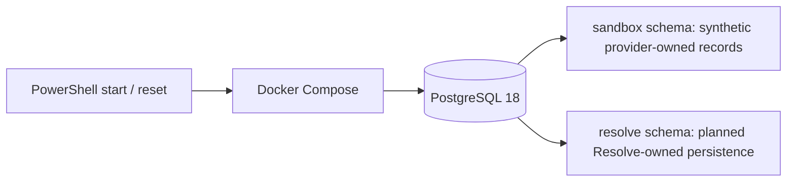

# Mock HUTCH environment

## Current qualification note (2026-10-02)

The running database is healthy, but this document's original fixture/readiness descriptions are intended outcomes, not a complete validation record. The [team context](../context.md) records confirmed B debit-sign and E duplicate-opening defects, other fixture inconsistencies, and readiness/reset lifecycle work under H-01. Fault profiles configure future behavior; no simulator runtime currently executes them. Use the [current shared contracts](contracts.md) for implementation.

## Deployment

One local database models provider ownership by schema and table contract. The container health check waits until migrations and initial fixtures finish, rather than only waiting for PostgreSQL's temporary bootstrap server. There are no separately deployed CRM, charging, or network services, and this repository does not contain a Resolve runtime.

## Sources and assumptions

The public evidence and limits below follow the reviewed architecture research. HUTCH publicly describes customer self-care, usage history, plan activation, bill payments and complaints ([HUTCH self-care](https://hutch.lk/hutch-self-care/)); its online recharge portal describes recharge, package activation and transaction results ([online recharge FAQ](https://hutch.lk/faq-online-web-recharge/)). Public evidence does not disclose the internal APIs or current schemas. Historical vendor references in the master plan are not grounds for treating any vendor as current. Every row here is generated synthetic data and vendor neutral.

Telecom-style boundaries for CRM/tickets, charging, recharge fulfilment, catalogue/VAS, quota and service assurance are **industry-based assumptions**. The prepaid-only scope, tax-inclusive synthetic prices, regional incident mapping, timeouts, retention and fault types are simulation choices, not statements about HUTCH policy.

## Tables and relationships

`sandbox.sandbox_runs` owns each isolated fixture set. Customers own prepaid accounts; accounts relate to balance snapshots and ordered money postings, recharge/payment and credit references, offers and subscriptions, subscription events, quota buckets/snapshots/entries, usage records, checks, incidents by region, and CRM-style tickets. Provider operations store idempotency outcome and fault profiles select simulator failure behavior. Composite sandbox foreign keys prevent cross-run references.

`resolve` contains the planned persistence boundary only: scoped sessions, conversations/messages, versioned cases, investigation evidence revisions, action proposals, confirmations and operations, append-only receipt revisions, Voice bindings/events, audit events, model usage and reviewed knowledge cards. Twelve English knowledge cards cite public HUTCH pages and keep limits explicit; English search terms include curated Sinhala/Tamil transliterations. Migration 003 adds same-run account/case/conversation constraints. No handlers or public routes exist here. The future Resolve DB role can read sandbox rows and mutate only Resolve-owned tables; receipts, audits, model usage and integration-event history remain append-only at the grant level.

Amounts are signed `bigint` minor LKR units (100 = LKR 1.00); usage and quota use integer bytes. Persist event occurrence separately from posting/recording time. IDs are UUIDs and mutable targets carry versions. The fixture clock is 2 October 2026, 12:00 Asia/Colombo; security grants, session and action expiries use real time.

## Fixture index

| Case | Seed evidence | Expected safe interpretation |
| --- | --- | --- |
| A | LKR 0 opening; +1,000 recharge, −499 package, −60 VAS, −21 rated use; LKR 420 close | Exact ledger tie-out. A future VAS deactivation can be proposed; historic dispute remains review work. |
| B | 20 GB grant, 11.4 + 5.2 + 3.4 GB consumed, zero remaining; 0.8 GB out of bundle linked to LKR 80 | Quota movements explain exhaustion; don't count usage or its linked money posting twice. Category is unknown. |
| C | Active account/package, 9.7 GB remaining, fresh data enabled check, South region mobile-data incident | Report only supplied evidence; no repair claim or invented ETA. |
| D | Same postings as A, closing snapshot LKR 350 | LKR 70 conflict blocks a conclusive diagnosis and account mutation; route for review. |
| E | LKR 500 payment captured, fulfilment pending, no credit entry; balance LKR 100 | Payment is not an account credit. Do not request another payment/recharge. |
| F | Active recurring VAS, posted charge, no activation evidence | Report missing evidence without asserting consent; confirmed future deactivation does not decide a past dispute. |

Fixtures use non-dialable `SIM-LK-*` aliases, synthetic identities, UTC-aware timestamps and versioned resources. Reset generates a new run and new deterministic row IDs while keeping old runs. Keep the volume out of source control.

## Reconciliation rules for future Resolve code

- Money closing = opening snapshot + each committed signed posting for the same account, wallet, currency and sequence interval. Pending/failed recharge is not a posting. A reversal is a separately linked opposite posting.
- Quota remaining = opening bucket bytes + grant, consumption, expiry and reversal entries. Usage explains consumption but is not an additional quota movement. Out-of-bundle usage does not debit the exhausted bundle.
- Preserve posting sequence and occurred/recorded times so a late posting is visible. A future provider result should carry source, fetched time, source version, completeness, watermark and cursor. Empty data means none only after a complete read.
- Freshness assumptions: account, balance and subscription 60 seconds; service checks five minutes. Missing incidents do not prove service health.

## Future provider contract surface (not implemented)

The eventual in-process providers should expose typed bounded reads for account, statement, recharge, offers/subscriptions, usage/quota and service status. Mutations are restricted to versioned/idempotent VAS deactivation, delivery of settings instructions and ticket creation/update. No refund, credit, recharge purchase or network repair is supported. Each result returns source metadata/completeness; each mutation returns durable operation ID and actual readback status. Simulator/admin endpoints must not be customer-facing. Pagination defaults to 100, capped at 500. Same key/body returns the saved result; same key with a different body conflicts.

Fault profiles cover late/duplicate posts, linked reversal, missing opening snapshot, pending payment, incomplete usage page, stale source, wrong unit, CRM outage, rejected writes, committed writes with lost responses, duplicate/stale confirmation and operation lookup failure. These rows configure a future simulator; they do not execute faults today.

## Local commands

Fresh volume initialization runs migrations 001, 002 and 003, then the baseline fixtures and knowledge cards. `scripts/reset.ps1` inserts a new fixture run without dropping history. `database/seed.sql` is the baseline; `scripts/seed_run.py` re-keys it for a requested run UUID using only Python's standard library. To discard all history, explicitly remove the Compose volume with `docker compose down -v`.
